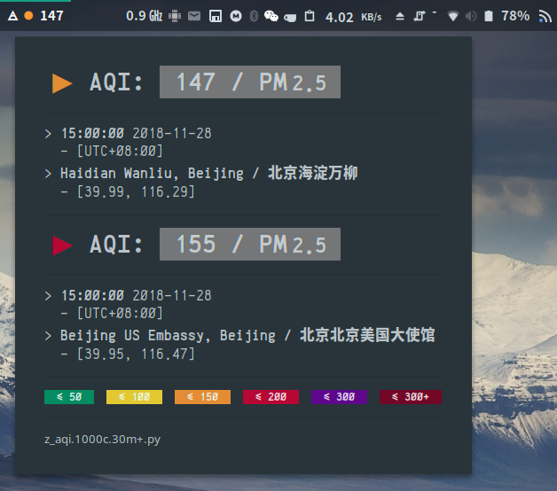

# 自用脚本 / My Helper Scripts

**\[ Under contruction / 在建 \]**

代码本自用，使用须谨慎；盲目运行，系统炸了，后果自负！

This repo consists of scripts that I write to make my life easier.

**Disclaimer:** I'm NOT a qualified programmer; rather, I'm a physics student who loves Linux & tinkering. Please check the code before you actually use it on your system. No compatibility is guaranteed.

### 测试环境 / Environments

- 系统 / OS: `Manjaro Linux v18.0.1 Illyria x86_64` - 基于 Arch, 使用 `pacman`
- 桌面 / Desktop: `GNOME v3.30.2`

  - **注意：** 本 repo 中的大量代码是针对 GNOME 编写的，为绕过其若干脑残的设计；这些脚本对非 GNOME 桌面而言可能意义不大。<br/>
    **Note:** Most scripts in this repo are tailored to GNOME, to circumvent many of its unreasonable design. These scripts might not be meaningful for other DEs.

### 说明 / Note

- 此 repo 对应本人的 `$HOME`, 为安全起见，建议：

  - `git clone` 到某个非 `$HOME` 的地方；<br/>
    / clone to somewhere other than `$HOME`;
  - 把需要的脚本逐渐移到（或链接到） `$HOME`; <br/>
    / move or link the wanted scripts to corresponding paths under `$HOME`;
  - 在 `$HOME` 下面先自建一个 git 仓库（注意配置好 `.gitignore`）然后再按需合并，**这是坠吼的！**<br/>
    / **Best Approach:** `git merge` to your own `$HOME` repo.

## 内容 / Contents

### `~/.shrc`

Bash 和 Zsh 共用的 `rc` 文件 / `rc` file shared between bash & zsh, sourced by `.bashrc` & `.zshrc`

### `~/.config/argos/`

Argos 脚本，在 GNOME 状态栏上显示各种有趣的东西 / Argos scripts

**依赖 / Dependencies:**

- GNOME 桌面
  - Argos 插件：[p-e-w/argos](https://github.com/p-e-w/argos), 了不起的好东西！

**内含脚本如下：**

#### `./z_aqi.1000c.30m+.sh` & `./aqi/`

从 [aqicn.org](https://aqicn.org) 和 [pm25.in](http://www.pm25.in/) （爬取，备用）获取空气质量指数，并显示在状态栏上 / get Air Quality Index (AQI):



**依赖 / Dependencies:**

- **文件 / File:** `~/.shrc`, 获取正确的 python 路径与 token;
- **变量 / Const:** `TOKEN_AQICN`, 用于访问 aqicn 的 API
  - 请自行前往 [aqicn.org/api](http://aqicn.org/api/) 申请，否则将 fallback 到 `token = demo` , 功能受限；
  - 获得 token 后，将其以 `TOKEN_AQICN='insert_token_here'` 形式保存到 `~/.tokens` 或直接保存到 `~/.shrc`.
- **包 / Pkg:** `python 3.7` 的 `requests[socks], pandas, beautifulsoup4` 模块，建议使用 Anaconda, 或用以下命令安装：

  ```
  pip install --user requests[socks] pandas beautifulsoup4
  ```

**使用方法 / Usage:**

```
cd ~/.config/argos; chmod +x z_aqi.1000c.30m+.sh
cd aqi; chmod +x widget.py
```

> _发布策略：`git merge --squash --no-commit --allow-unrelated-histories HOME`_
